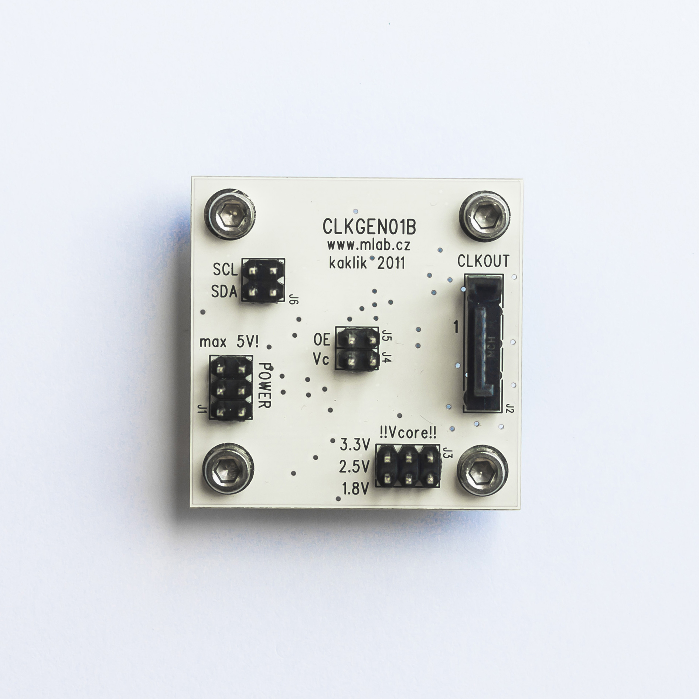

# CLKGEN01 - Single output I2C programmable low-jitter clock generator

## Description
The CLKGEN01B is a low-jitter, single-output, I2C programmable clock generator designed for high-end ADC in SDR applications. It is suitable for generating a stable, low-noise clock signal with a wide tunable frequency range.

## Technical Parameters
- **Power Voltage:** Max 5V, 160mA
- **Core Power Voltage:** +1.8V, 2.7V, 3.3V (depends on chip type)
- **Frequency Range:** 10 - 1500 MHz (depends on chip type, usually 10 - 810MHz)
- **Phase Jitter:** < 0.3ps for Si570 types

## Construction
### Circuit
The circuit is optimized for direct connection to a microprocessor with similar or higher output logic levels over the Si5XX chip. A voltage level translator is integrated for applications requiring different voltage levels. The internal lower voltage can be stabilized by the integrated linear voltage stabilizer. The module output is differential, but a single-sided CMOS output chip can be populated.

### EMI Suppression
The CLKGEN01B module can be a significant source of noise due to its signal-generator nature. Proper EMI isolation is necessary, which can be achieved using a high conductive base like ALBASE.

### Mechanical Construction
The module is mounted on a base using four screws. To ensure proper shielding, it is recommended to secure all screws with a conductive base.

## Testing
### Setting
On startup, a preset frequency is sent at the output. There is an option to calibrate the clock source via the I2C bus.

## Software Tools
In combination with other modules, the generator can be tuned via a computer. One simple solution is using the PIC18F4550v01A module and firmware, allowing the use of any software compatible with the design, such as USBSynth or CFGSR.

## Documentation and Downloads
- [CLKGEN01B Datasheet](file:///path/to/CLKGEN01B.en.pdf)
- [Si570 Datasheet](file:///path/to/Si570.pdf)
- [Buy CLKGEN01B](http://www.ust.cz/shop/product_info.php?products_id=78)
- [PIC Firmware](http://www.mlab.cz/Modules/Clock/CLKGEN01B/SW/DG8SAQ%20synthesiser_Emulator/firmware.hex)

## References
- [Original construction of Si570 Board](http://wb6dhw.com/inactive.html)
- [PIC emulator of USB synthesizer DG8SAQ](http://www.qrpradio.org/pub/softrocks/manuals/Softrock%20Group%20Files%20210109/21%209V1AL/02%20UBW%20Emulator/README.txt)
- [Wideband RF Synthesizer](http://www.mydarc.de/dg8saq/SI570/index.shtml)
- [USB Synth](http://www.mydarc.de/dg8saq/hidden/USB%20Synth3.zip)
